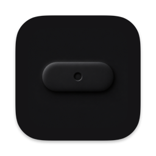
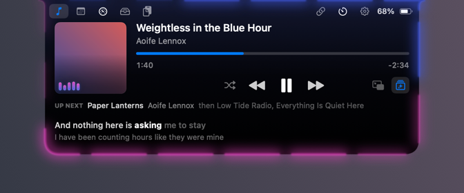
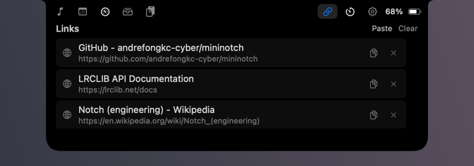
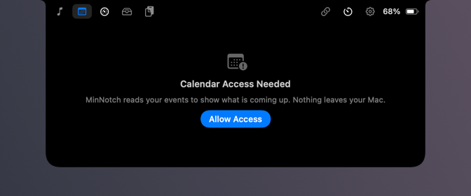
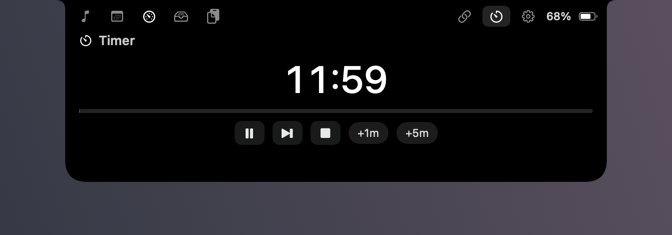
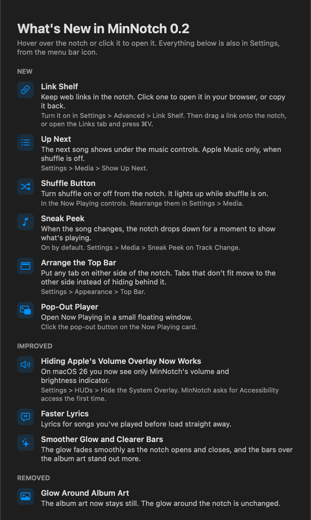

# MinNotch

A macOS app that lives in the notch. Closed, it is a black pill the size of the camera housing.
Hover or click it and it opens into a panel: what is playing, your calendar, system stats, a file
shelf, saved links, a timer.



## Download

[**MinNotch 0.2.0**](https://github.com/andrefongkc-cyber/mininotch/releases/latest) — open the
DMG, drag MinNotch to Applications.

The first launch is blocked, because notarising an app needs a paid Apple membership this project
does not have. Open **System Settings > Privacy & Security**, scroll down, and click **Open
Anyway**. That is once per version.

Requires macOS 14.4 or later, Apple silicon or Intel; on anything older, macOS refuses to open
it. A Mac with no notch gets a virtual one in the same place.

## What it does

**Now Playing** for Apple Music, Spotify, and a system-wide fallback for other apps. Album art, a
scrubber you can drag to seek, transport controls with a working shuffle button, Up Next for Apple
Music, and synced lyrics that highlight the word being sung.


Closed, the pill can show the artwork, the battery, and a running timer. It is off by default on a
Mac with a notch, where the pill sits behind the camera housing; turn it on in Settings > General.

**Sneak peek.** When the song changes, the notch drops down for a couple of seconds with the cover
and the title, instead of opening the whole panel.


**Ambient lighting** around the closed pill or the open panel, in five styles, coloured from the
album art. With the system audio permission granted it follows what is actually playing; without
it, it animates on its own. With nothing playing it stays still.

**Link Shelf.** Drag a link onto the notch or press ⌘V, and it is kept with its page title and
site icon. Click to open it, or copy it back.



**Calendar and Reminders** for the week or month, with per-calendar visibility, tick-off, and a
quick-add field.



**Timer and Pomodoro**, four rhythms, quick countdowns, and a custom length. A running timer shows
in the closed pill.



Also:

- **Shelf** to park files on the notch and drag them out somewhere else.
- **System stats**: CPU, GPU, memory, network, and the charge of connected AirPods and accessories.
- **Volume, brightness and keyboard backlight** shown at the notch, optionally instead of Apple's
  own overlay, which MinNotch hides by taking those keys before macOS sees them (needs
  Accessibility).
- **Clipboard history** for text, links, colours, and images, held in memory only.
- **Floating Now Playing window** for a display with no notch worth looking at.
- **Two-finger swipes** to change tab or open and close, with optional haptics.
- **Drag-to-arrange layouts** for the transport controls, the closed pill's two sides, and the open
  panel's top bar, tabs included. Anything that will not fit beside the notch moves to the other
  side of it rather than hiding behind the camera.
- **Settings** in their own window with search: press ⌘F, type, and a result takes you to the row.
- **What's New** after each update, and a welcome tour on first launch.



## Performance

Measured on an M4 MacBook Air, 2560x1664 display, with an optimised build. Each figure is the
median of eight samples of `ps %cpu`, where 100% is one core, taken while that state was on screen
for fourteen seconds.

| What is on screen | CPU | Memory |
|---|---|---|
| Closed pill, nothing playing | 0.0% | 55 MB |
| Closed pill, music playing | 0.0% | 54 MB |
| Closed pill with ambient lighting | 26.4% | 52 MB |
| Open panel, Now Playing | 6.9% | 66 MB |
| Open panel, Now Playing with ambient lighting | 27.6% | 72 MB |
| Open panel, calendar | 0.0% | 60 MB |
| Open panel, system stats | 0.7% | 56 MB |

What that means in practice: MinNotch costs nothing while it sits closed, which is almost all of
the time. Animation is what costs, and the ambient glow costs about a quarter of one core for as
long as it is visible — on a ten-core M4, roughly 3% of the machine. Everything that polls, system
stats included, samples only while its widget is on screen, and the audio tap runs only if you
switch on Follow the Beat or lyric matching.

## Permissions

Nothing is asked for at launch. Each is requested the first time a feature needs it:

| What | Used for |
|---|---|
| Automation | Reading and controlling Music and Spotify |
| Calendar and Reminders | Showing your events |
| Notifications | Low-battery and timer alerts |
| System audio recording | Only for ambient lighting that follows the beat, and lyric matching |
| Accessibility | Only to hide Apple's volume and brightness overlay |

Everything stays on your Mac, with one exception that is off by default: setting **Media > Lyrics
Source** to look up online sends the current title, artist, album and length to `lrclib.net`. No
accounts, no analytics, no telemetry. Clipboard history is never written to disk, and it skips
anything an app marks as private. Audio becomes a handful of numbers per buffer and is discarded;
nothing is recorded.

## Building

```bash
Scripts/run.sh            # build and relaunch
Scripts/run.sh --no-build # relaunch without rebuilding, keeping granted permissions
```

Signing needs your own Apple team, and a free Apple ID is enough. Copy
`Config/Local.xcconfig.example` to `Config/Local.xcconfig` and put your team in it; that file is
gitignored. Without it the build stops and says a development team is required.

Xcode 16 or later. No dependencies, no package manager, no test target yet.

## Releasing

```bash
Scripts/release.sh              # writes dist/MinNotch-<version>.dmg
Scripts/release.sh --anonymous  # the same, re-signed to carry no Apple team or ID
```

It prints the `gh release create` line that publishes the DMG, using `Scripts/release-notes.sh` for
the description so the GitHub page and the app's own What's New window say the same thing. Bump
`MARKETING_VERSION` and update `ReleaseNotes.latest` first; the script warns if they disagree.

## Repository

`CLAUDE.md` is the architecture and the traps worth knowing before changing anything.
`WORKPLAN.md` tracks what is built, what is not, and what was deliberately abandoned.

No licence has been chosen, so all rights are reserved for now.
