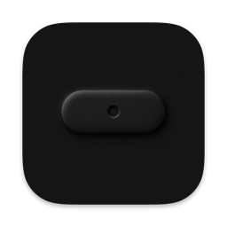
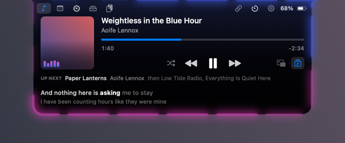
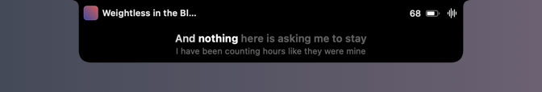
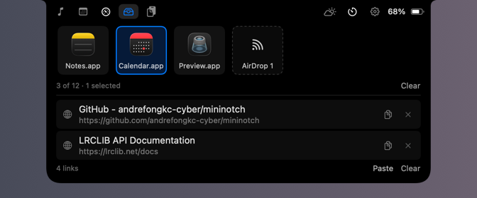
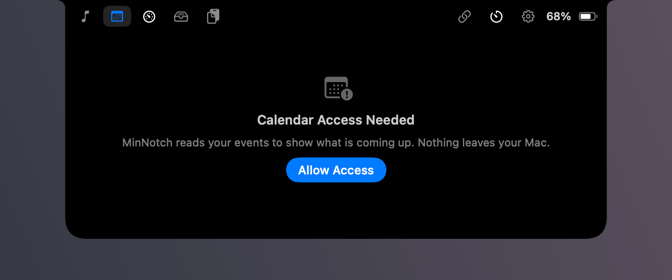
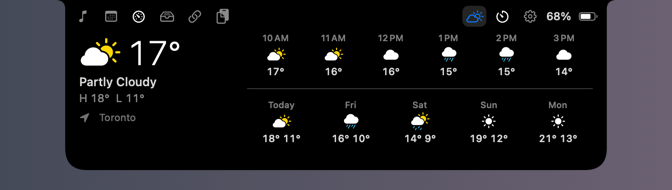
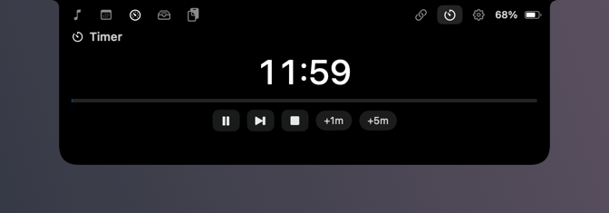

# MiniNotch

A macOS app that lives in the notch. Closed, it is a black pill the size of the camera housing.
Hover or click it and it opens into a panel: what is playing, your calendar, the weather, system
stats, a file shelf, saved links, a timer.



## Download

[**MiniNotch 0.6.0**](https://github.com/andrefongkc-cyber/mininotch/releases/latest) — open the
DMG, drag MiniNotch to Applications. It runs in the background: no Dock icon and nothing in ⌘-Tab,
just the notch and an optional menu bar icon. Quit it from that icon or from Settings > About.

The first launch is blocked, because notarising an app needs a paid Apple membership this project
does not have. Open **System Settings > Privacy & Security**, scroll down, and click **Open
Anyway**.

From 0.7 on, MiniNotch keeps itself up to date: it checks for a new version once a day and asks
before installing it, or check yourself from the menu bar icon _(next)_. Earlier versions have to be
updated by hand once, to 0.7.

Requires macOS 14.4 or later, Apple silicon or Intel; on anything older, macOS refuses to open
it. A Mac with no notch gets a virtual one in the same place, and on an external monitor it can
stay out of sight until the pointer reaches the top middle of the screen.

## What it does

**Now Playing** for Apple Music, Spotify, VLC, and a system-wide fallback for other apps. Album
art, a scrubber you can drag to seek, transport controls with shuffle, repeat and favourite, three
card styles, and synced lyrics that highlight the word being sung, with a full scrolling list you
can click to jump to a line. With the system audio permission, lyrics that run early or late are
lined up with the singing, and each song's correction is remembered.


Closed, the pill can show the cover and the song's title or artist, the battery, a playing
indicator, and live activities: a running timer, a download's progress, or your AirPods' charge
when they connect. What goes on which side is yours to arrange in Settings > Layout, on a picture
of the pill that shows what it is showing right now. It is off by default on a Mac with a notch,
where the pill sits behind the camera housing; turn it on in Settings > Layout.

**Lyrics with the notch closed**. The line being sung, just under the closed pill, while a
song plays.



**Sneak peek.** When the song changes, the notch drops down with the cover and the title, instead
of opening the whole panel, for as long as you set.


**Ambient lighting** around the closed pill or the open panel, in five styles, coloured from the
album art. With the system audio permission granted it follows what is actually playing; without
it, it keeps the song's own tempo from Music, a tempo you tap out, or one of its own. With nothing
playing it stays still.

**Shelf.** Park files and links on the notch. Drag files onto it and drag them out somewhere else
later, several at once, or send them with AirDrop. Drag a link onto it or press ⌘V and it is kept
with its page title and site icon; click to open it, or copy it back. ⌘V also holds files you
copied in Finder.



**Calendar and Reminders** for the week or month, with per-calendar visibility, tick-off, and a
quick-add field. Click a day to see what is on it, and use the arrows to move between weeks or
months. Before a meeting, a countdown shows in the closed pill, and Zoom, Meet, Teams, Webex and
FaceTime meetings get a Join button.



**Weather** for where you are or a city you pick, with the next hours and days, and the
temperature in the closed pill if you place it there. Forecasts come from Open-Meteo, which needs
no account.



**Timer and Pomodoro**, four rhythms, quick countdowns, and a custom length. A running timer shows
in the closed pill.



Also:

- **Keep the notch open** with ⌃⌥P, on whichever display it is on, while you work on another.
- **Notes**: a scratchpad in its own tab, kept on your Mac between opens.
- **Sound output**: switch between speakers, AirPods and displays, and set the volume, from
  the Now Playing card.
- **System stats**: CPU, GPU, memory, network, and the charge of connected AirPods and accessories,
  each with a graph of the last five minutes, plus the chip, battery and SSD temperatures.
  Plugged in, it shows what the charger is giving, what the Mac uses, and how much of it is going
  into the battery.
- **Volume, brightness and keyboard backlight** shown at the notch, optionally instead of Apple's
  own overlay, which MiniNotch hides by taking those keys before macOS sees them (needs
  Accessibility). They also show over the lock screen, as does the song with its controls.
- **Clipboard history** for text, links, colours, and images, held in memory only.
- **Floating Now Playing window** for a display with no notch worth looking at.
- **Two-finger swipes** to change tab or open and close, with optional haptics.
- **Drag-to-arrange layouts** for the transport controls, the closed pill's two sides, and the open
  panel's top bar, tabs included, all in Settings > Layout. An icon lands where you let go of it.
  Anything that will not fit beside the notch moves to the other side of it rather than hiding
  behind the camera.
- **Settings** in their own window with search: press ⌘F, type, and a result takes you to the row.
  What is new in an update is marked New.
- **What's New** after each update, and a welcome tour on first launch.


## Performance

Measured on an M4 MacBook Air, 2560x1664 display, with an optimised build. Each figure is the
median of eight samples of `ps %cpu`, where 100% is one core, taken while that state was on screen
for fourteen seconds.

| What is on screen | CPU | Memory |
|---|---|---|
| Closed pill, nothing playing | 0.0% | 55 MB |
| Closed pill, music playing | 0.0% | 54 MB |
| Closed pill with ambient lighting | 26.4% | 52 MB |
| Open panel, Now Playing | 6.9% | 66 MB |
| Open panel, Now Playing with ambient lighting | 27.6% | 72 MB |
| Open panel, calendar | 0.0% | 60 MB |
| Open panel, system stats | 0.7% | 56 MB |

What that means in practice: MiniNotch costs nothing while it sits closed, which is almost all of
the time. Animation is what costs, and the ambient glow costs about a quarter of one core for as
long as it is visible — on a ten-core M4, roughly 3% of the machine. Everything that polls samples
only while its widget is on screen, except system stats, which take a reading every five seconds
in the background so their graphs keep the last five minutes, about a quarter of a percent of one
core. The audio tap runs only if you switch on Follow the Beat or Fix Timing Automatically, and
only while something is playing.

## Permissions

Nothing is asked for at launch. The welcome tour lists every one of these with a button to allow it
there and then; otherwise each is requested the first time a feature needs it:

| What | Used for |
|---|---|
| Automation | Reading and controlling Music and Spotify |
| Calendar and Reminders | Showing your events |
| Notifications | Low-battery and timer alerts |
| System audio recording | Only for ambient lighting that follows the beat, and fixing lyric timing |
| Accessibility | Only to hide Apple's volume and brightness overlay |
| Location | Only for weather where you are; a city you type needs none |

Everything stays on your Mac, with two exceptions, both off by default: setting **Media > Lyrics
Source** to look up online sends the current title, artist, album and length to `lrclib.net`, and
**Weather** sends a location rounded to about a kilometre, or the city you chose, to
`open-meteo.com`. Checking for updates fetches one small file from GitHub a day and sends nothing
about your Mac; switch it off in Settings > About _(next)_. No accounts, no analytics, no telemetry. Clipboard history is never written to disk, and it skips
anything an app marks as private. Audio becomes a handful of numbers per buffer and is discarded;
nothing is recorded.

## Building

```bash
Scripts/run.sh            # build and relaunch
Scripts/run.sh --no-build # relaunch without rebuilding, keeping granted permissions
```

Signing needs your own Apple team, and a free Apple ID is enough. Copy
`Config/Local.xcconfig.example` to `Config/Local.xcconfig` and put your team in it; that file is
gitignored. Without it the build stops and says a development team is required.

Xcode 16 or later. One dependency, [Sparkle](https://sparkle-project.org) for updates, which Xcode
fetches through Swift Package Manager on the first build. No test target yet.

## Releasing

```bash
Scripts/release.sh              # writes dist/MiniNotch-<version>.dmg
Scripts/release.sh --anonymous  # the same, re-signed to carry no Apple team or ID
```

It signs the DMG for Sparkle with the update key in this Mac's keychain, adds it to `appcast.xml`
(`Scripts/appcast.sh`), and prints the two commands that publish it, in order: `gh release create`,
using `Scripts/release-notes.sh` for the description so the GitHub page and the app's own What's
New window say the same thing, and then the commit and push of `appcast.xml`, so the feed never
points at a DMG that is not there yet. Bump `MARKETING_VERSION` and update `ReleaseNotes.latest`
first; the script warns if they disagree.

## Repository

`CLAUDE.md` is the architecture and the traps worth knowing before changing anything.
`WORKPLAN.md` tracks what is built, what is not, and what was deliberately abandoned.

No licence has been chosen, so all rights are reserved for now.
